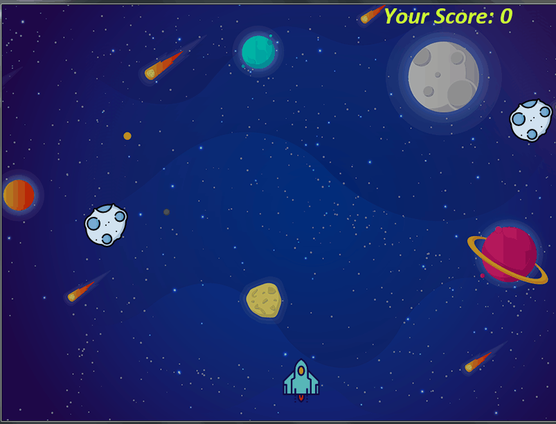

# Space-Rocket
A simple GUI game implemented using Pygame Library of Python.

### Gameplay

### Future Upgradation
Rocket able to shoot lasers and destroy approaching targets.
Adding more different types of asteroids and enemy ships.

Please tell me how is it guys! And open to any contributions!

### Open Source

